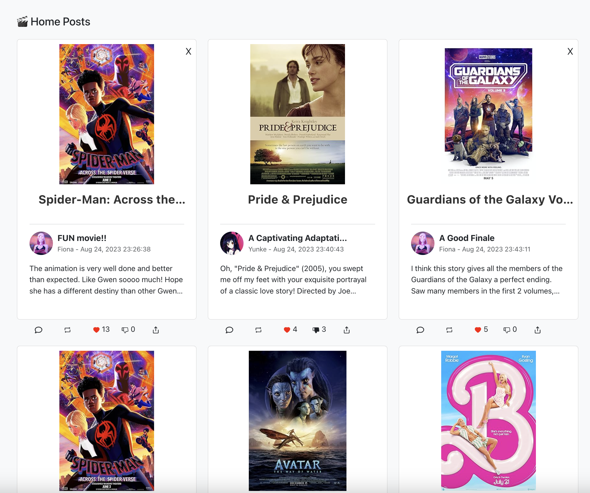
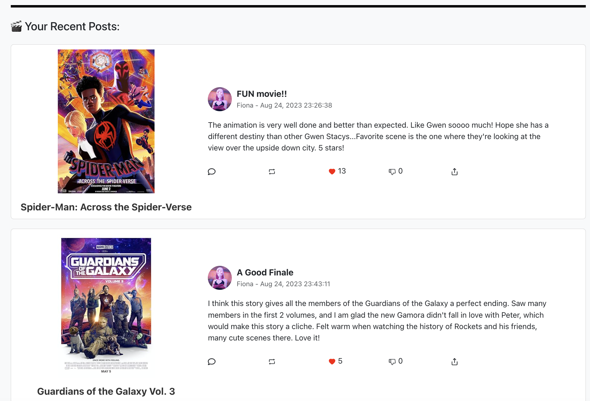
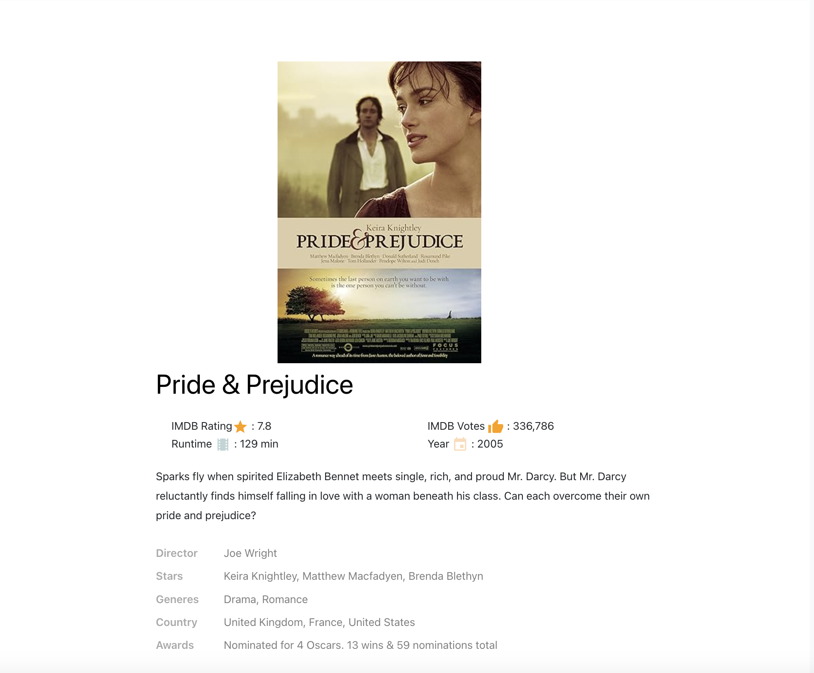
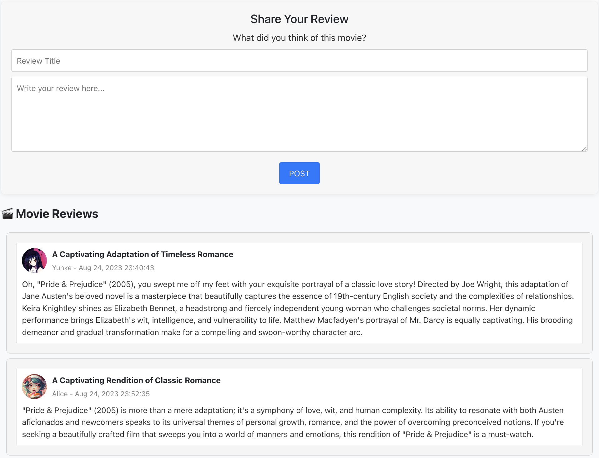
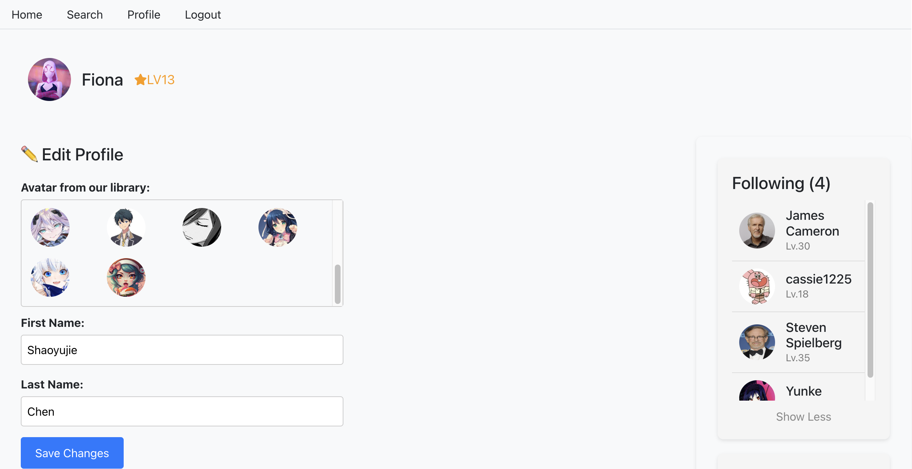
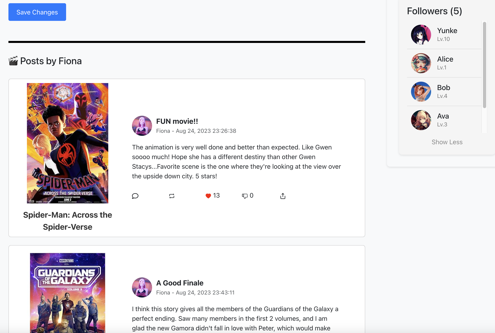
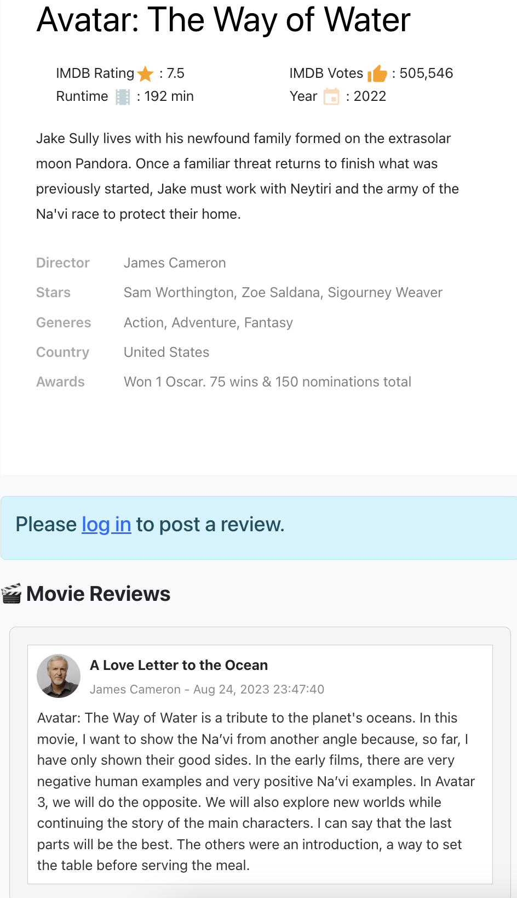

# React App of Movie Reviewer Website
A functional, user-friendly platform designed for film enthusiasts to engage in film analysis and connect with a community of fellow film lovers.

This is the front-end of the website, the backend using Node.js and MongoDB can be found at: [here](https://github.com/FionaChen0506/webdev-project-node-server)   

### Application Setup and Instructions
Run the following command to start the Node.js server:
#### `node app.js`

Once the server is running, you can access the following endpoints:
- http://localhost:4000/api/users to view users' data.
- http://localhost:4000/api/posts to view posts' data.

Then, to run the app in development mode, use the following command:
#### `npm start`
Then open http://localhost:3000 in your browser to view the website.

## Overview
* Technologies: JavaScript, React.js, Node.js, MongoDB, IMDb API.
* User Roles: Implemented user registration with options for regular users and verified users (resembling industry professionals such as directors or actors), with an admin role for content management.
* Functionality: Implemented features, differentiating between anonymous users and registered users. These features include movie searches, review submissions, profile customization, and followship betwwen users. Anonymous users can explore movie information and read reviews. Registered users can submit reviews, customize profile, and engage in social interactions by following and unfollowing other users.
* Responsive UI: Ensured a responsive user interface that maintains structural integrity and alignment.

## Functionalities
### Home Page
* The home page displays all posts, with the latest post shown at the top. 

* For anonymous users, a prompt will appear asking you to log in.

* For logged-in users, they can delete their own posts by clicing "X", and their recent posts will be displayed at the bottom of the page.

 
* Each post includes the movie's poster and name; user's name and avatar; post's title, time and the first three lines. The posts can be liked and disliked by all registered users. 
* By clicking the movie's poster, users can go to [movie's details page](#movie-details-page). By clicking the user avatar, users can go to that user's [profile page](#users-profile-page).

### Movie Details Page
* The movie's details page displays a section where logged-in users can post reviews, along with all the reviews related to that movie. By clicking the user's avatar in the reviews, users can go to that user's [profile page](#users-profile-page).

 

  
### Users Profile Page
* When users are viewing their own profile page, they can edit their profile by changing their avatar or updating their names, view and expand/collapse their follow/follower lists, and see their recent posts.

* When viewing another user's profile page, users will see the person's name, avatar, follow/unfollow button, and the number of followers and followings they have.

### Register page
* If the checking box is not selected, the user will be registered as a regular user, which can search movies, write and delete posts, follow/unfollow others, modify own profile, view other's profile.
* The users can choose to select the checking box to be a verified user (resembling industry professionals such as directors or actors). Their profile page will be slightly different from regular users with some informations about their movies.

   
### Login page

   
### Search page
* By clicking to the movie title in the search result list, users can go to the [movie's details page](#movie-details-page).

## User Roles and Access Control
### Anonymous User
 * The anonymous user can only view others' posts, but can not write posts themselves.
 * The anonymous user can not like/dislike posts.
 * The anonymous user can not follow/unfollow others.

  
### Regular User
* Regular user's home page has a section shows all the posts of the user.  
* Regular users can delete their own posts from the home page by clicking the X button. 
* Regular users have a [profile page](#users-profile-page).
* Regular users can go to other user's profile page to follow/unfollow.  

* Regular users can write and publish posts  

### Verified User  
* Verified users have all functionalities same as regular users, the only difference is their profile page can show the three most popular movies ralated to them. Each of the movie's image is also clickable, will render to the movie's information page.

### Admin User  
* Admin users, created exclusively by developers, have the ability to delete any posts.

## Responsive UI 
* The web page can automatically change the layout showing on different sizes of windows.

